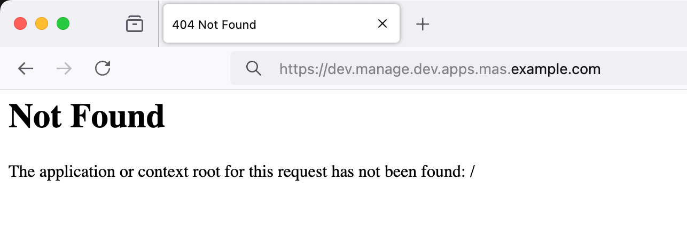

# IBM MAS Manage - Automatic Root Context Redirect
This repository contains example implementation of the "root context redirect" for IBM MAS Manage. It allows to gracefully handle MAS Manage URLs without or with incorrect context and therefore avoid **HTTP404** errors.

When packaged as a part of customization archive and registered in the servers bundle's `server.xml` enables automatic `/maximo` context redirects when **root** or any other unknown context has been requested. 

## Usage

1. Include `tools/**` in the MAS Manage customization archive.
2. Register `root-context-redirect` web application in the server bundle's [aditional server config](https://www.ibm.com/docs/en/mas-cd/maximo-manage/continuous-delivery?topic=customizing-configuring-application-server) (e.g. [server.xml](server.xml)).

## Customization

### Other Server Bundles Support

Example [postpreprocessor.sh](tools/maximo/en/postpreprocessor.sh) implementation supports **ALL** server bundle. It can be easily extended though to support other types of server bundles by copying [root-context-redirect.war](tools/maximo/en/root-context-redirect.war) to other deployment directories e.g. `maximo-ui`.

### Different Default Context

Example [root-context-redirect.war](tools/maximo/en/root-context-redirect.war) implementation redirects users to the `/maximo` context. This can be changed by updating `root-context-redirect.war/index.html` content. 

### Dynamic Redirect Rules

For the sake of simplicity example [root-context-redirect.war](tools/maximo/en/root-context-redirect.war) implementation hooks up to any kind of error (HTTP4xx, HTTP5xx) and blindly redirects users to the default context. It can be replaced thought by any other fully functional web application which implements more sophisticated error and redirect handling e.g. by preserving parts of the original URL context, query parameters, headers, etc.