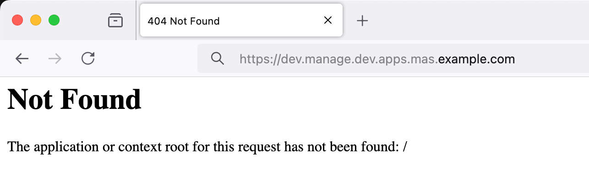

# IBM MAS Manage - Automatic Root Context Redirect
This repository contains example implementation of the "root context redirect" for IBM MAS Manage. It allows to gracefully handle MAS Manage URLs without or with incorrect context and therefore avoid **HTTP404** errors.

When packaged as a part of customization archive and registered in the servers bundle's `server.xml` enables automatic `/maximo` context redirects when **root** or any other unknown context has been requested. 

## Usage

### Alternative 1

1. Include `tools/**` in the MAS Manage customization archive or build your own customization archive directly using [package.sh](package.sh) script.

> **Update (Dec 2025):** Inspired by [Jason VenHuizen's ](https://www.linkedin.com/in/venhuizen/) [MAS Maximo Redirect](https://github.com/sharptree/mas-maximo-redirect) implementation, being *more simple and easier to maintain*, I'm bringing the best out of his solution, namely:
> 
> * direct `server.xml` scripting
> * support for all user-facing server bundle types (`all` + `ui`)
> * customization archive packaging
>
> **NOTE:** I still opt for custom WAR deployment because of cleaner user experience (`HTTP 200` + `redirect` rather than `HTTP 404 Not found` + `redirect` using `httpDispatcher` adjustments).

### Alternative 2

1. Comment out `server.xml` update section in the [postpreprocessor.sh](tools/maximo/en/root-context-redirect/postpreprocessor.sh) file.
2. Include `tools/**` in the MAS Manage customization archive or build your own customization archive directly using [package.sh](package.sh) script.
3. Register `root-context-redirect` web application in the server bundle's [aditional server config](https://www.ibm.com/docs/en/mas-cd/maximo-manage/continuous-delivery?topic=customizing-configuring-application-server) (e.g. [server.xml](server.xml)).

## Customization

### Different Default Context

Example [root-context-redirect.war](tools/maximo/en/root-context-redirect.war) implementation redirects users to the `/maximo` context. This can be changed by updating `root-context-redirect.war/index.html` content. 

### Dynamic Redirect Rules

For the sake of simplicity example [root-context-redirect.war](tools/maximo/en/root-context-redirect.war) implementation hooks up to any kind of error (HTTP4xx, HTTP5xx) and blindly redirects users to the default context. It can be replaced thought by any other fully functional web application which implements more sophisticated error and redirect handling e.g. by preserving parts of the original URL context, query parameters, headers, etc.